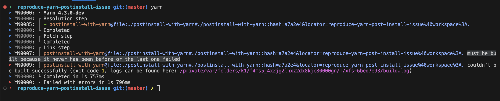

# Issue
when running `yarn install` script, there is an error occur: 
"xx must be built because it never has been before or the last one failed"

# Preconditions
1. using yarnPath with a pre-built yarn.js to standerlize each team member's yarn version.
2. some of our script include `yarn` command in the postinstall script.

